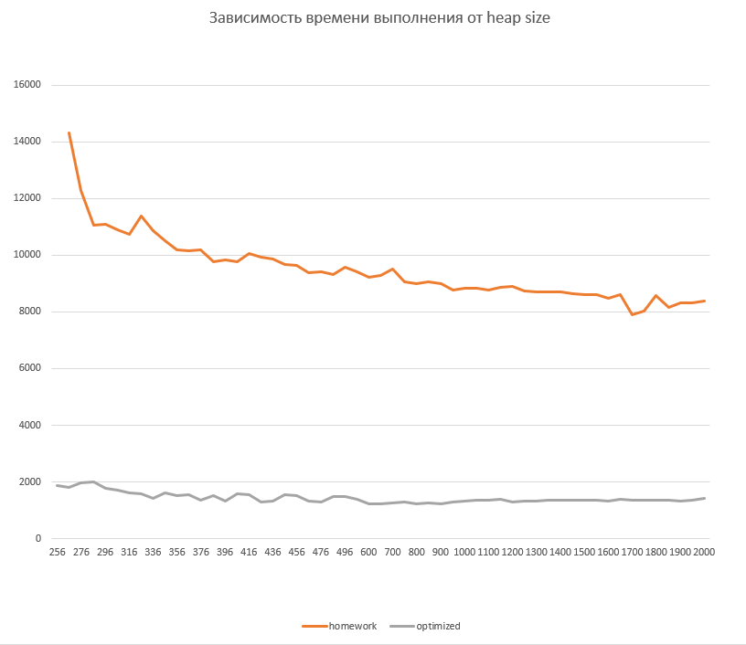

Были выполнены прогоны программы на разных размерах heap c 256 до 2Гб.

График зависимости времени выполнения от размера хипа представлен в файлах report.xlsx и на графиге chart.png.

Также программа была оптимизирована через исключения операций boxing\unboxing(модуль находится в папке optimized).

На оранжевом графике показано повередние неоптимизированной программы, а на сером оптимизированной.

Неоптимизированная программа выходит на плато по времени выполнения ближе к **2Гб** хипа, а оптимизированная в районе **600мб**. Ясно видно, то нагрузка на GC во втором случае ниже, т.к. необходимый размер хипа существенно ниже, не говоря уже о скорости работы. Постоянное создание эксемпляров Integer многократно влияет на скорость работы.
